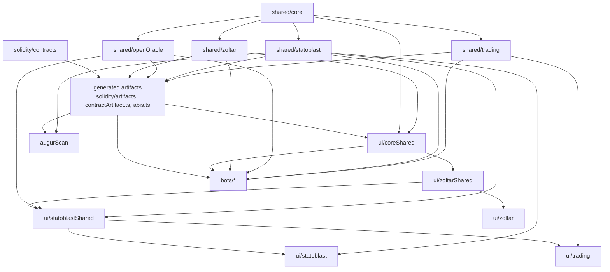

# Architecture

This page maps the repository for contributors. Protocol behavior is explained in the [published documentation](https://augurproject.github.io/zoltar/docs/documentation.html); commands are in the [README](./README.md); repository rules are in [AGENTS.md](./AGENTS.md).

## Product layers

| Layer | What it is | Contracts | Off-chain code |
| --- | --- | --- | --- |
| Zoltar | The forkable oracle base layer: questions, universes, REP, and forks. It never judges which answer is true. | `solidity/contracts/*.sol` | `shared/zoltar`, `ui/zoltarShared`, `ui/zoltar` |
| Statoblast | The prediction-market layer: one SecurityPool per question and universe, the Escalation Game, fork migration, and Truth Auctions. | `solidity/contracts/statoblast/` | `shared/statoblast`, `ui/statoblastShared`, `ui/statoblast` |
| OpenOracle | A contestable REP/ETH price feed used for solvency checks, never for market outcomes. The imported contract is a fixed compatibility contract. | `solidity/contracts/statoblast/openOracle/` | `shared/openOracle`, `ui/statoblastShared` |
| Trading | An AMM exchange for Statoblast outcome shares; one possible venue, with no role in market creation or resolution. | `solidity/contracts/trading/` | `shared/trading`, `ui/trading` |
| augurScan | A read-only explorer and PostgreSQL indexer for every layer. | none | `augurScan/` |
| Bots | Permissionless operators: `liquidator`, `open-oracle-arbitrager`, and the testnet `chaos` exerciser, with common code in `bots/shared`. | `bots/open-oracle-arbitrager/contracts/` | `bots/*` |

Start with the [system overview](https://augurproject.github.io/zoltar/docs/explanation/system-overview.html), then [Zoltar](https://augurproject.github.io/zoltar/docs/explanation/zoltar.html), [Statoblast](https://augurproject.github.io/zoltar/docs/explanation/statoblast.html), [OpenOracle](https://augurproject.github.io/zoltar/docs/explanation/open-oracle.html), [Trading](https://augurproject.github.io/zoltar/docs/explanation/trading.html), and the [contract architecture](https://augurproject.github.io/zoltar/docs/explanation/contract-architecture.html).

## Dependency graph

Arrows point from a dependency to its consumers. `tooling/repo/projects.ts` is the canonical build graph; `tooling/repo/sharedPackages.ts` declares the `shared/*` order.

The UI apps are dependency leaves: shared libraries never import apps, and apps never import one another. `bun run check:static` enforces the UI layer and `shared/*` boundaries.

## Where does X live?

- **A contract**: Zoltar core in `solidity/contracts/`, Statoblast and OpenOracle in `solidity/contracts/statoblast/`, Trading in `solidity/contracts/trading/`. Contract tests live in `solidity/ts/tests/`.
- **Pure protocol math, encoding, or addresses** used by more than one runtime: the lowest `shared/*` package that owns the concept. `shared/*` is runtime-neutral and has no UI code.
- **UI code**: runtime-neutral primitives, wallet, simulation, and generic workflows in `ui/coreShared`; product capabilities in `ui/zoltarShared` or `ui/statoblastShared`; bootstrap, routes, pages, and app tests in `ui/<app>`. See [ui/AGENTS.md](./ui/AGENTS.md).
- **Build, CI, test, and documentation tooling**: `tooling/{repo,ci,testing,contracts,docs,ui}`. The pinned Uniswap deployment input is the only file under `scripts/`.
- **Published documentation**: HTML under `docs/`, with its rules in [docs/AGENTS.md](./docs/AGENTS.md).
- **Generated output**: never hand-edit it. `tooling/repo/generated-artifacts.ts` lists every output, whether Git tracks it, and the command that recreates it.

## Generate pipeline

- `bun run generate` compiles the contracts (building the `shared/*` packages first, then writing `solidity/artifacts` and the TypeScript contract bindings in `solidity/ts/types` and the UI packages), vendors browser dependencies into `ui/*/vendor`, and builds the augurScan metadata and browser bundle.
- `bun run setup` installs dependencies from the root frozen lockfile, runs `generate`, then builds the UI libraries, apps, workers, and test bundles in dependency order.
- Most test, typecheck, and build commands run `ensure-contract-artifacts` first, which rebuilds stale shared packages and contract artifacts from content hashes. Commands ending in `:current` skip their preparation step and use what is already on disk; see [Script families](./README.md#script-families).
