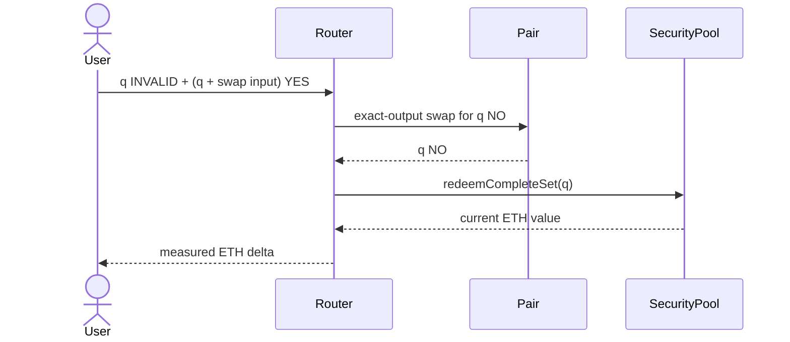

# Why early ETH exits are limited

To redeem `q` complete sets from a long-YES wallet, the router needs `q` INVALID, `q` YES for the sets, and extra YES to purchase exactly `q` NO. The bounds are:

```text
q ≤ wallet INVALID
q + required YES input(q) ≤ wallet YES
q < pair NO reserve
```

The SDK binary-searches these monotonic conditions; the actual candidate is then simulated through the router.



Example: a wallet has 150 INVALID and 260 YES. If buying 100 NO requires 112 YES, redeeming 100 sets requires 212 YES and succeeds. Trying 150 might require 181 extra YES, or 331 total, and fails on YES even though INVALID covers it. If the wallet has only 60 INVALID, at most 60 sets are insured. Excess YES profit remains a valid directional asset; it has not disappeared.
