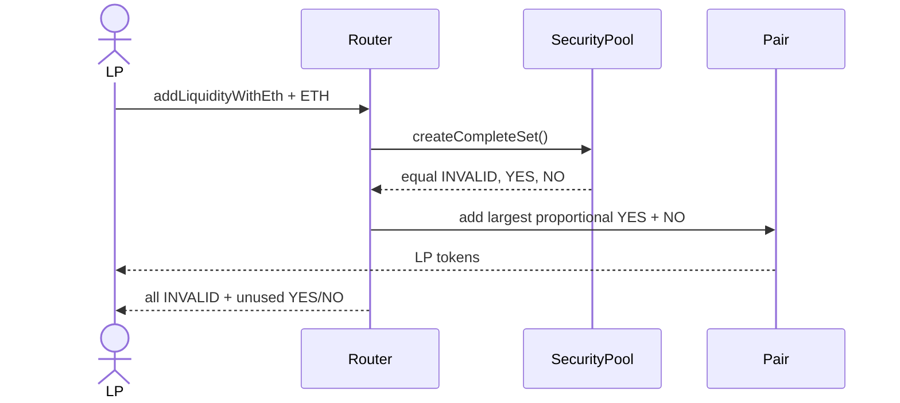

# Liquidity-provider position

Initial LP supply uses the smaller reserve as an accounting scale. The pair permanently mints 1,000 units to the zero address, then mints `min(YES, NO) − 1,000` to the initializer. At very large Zoltar share scales this avoids an overflowing geometric-mean multiplication. Absolute LP supply is arbitrary; `wallet LP / total LP` defines ownership.

Direct valid YES/NO donations are synchronized and accrue to existing LPs. Removal returns proportional raw shares even after trading closes. Coverage shown in the portfolio is an estimate comparing separate wallet INVALID with the LP reserve claim; the LP token itself is never called insured.
