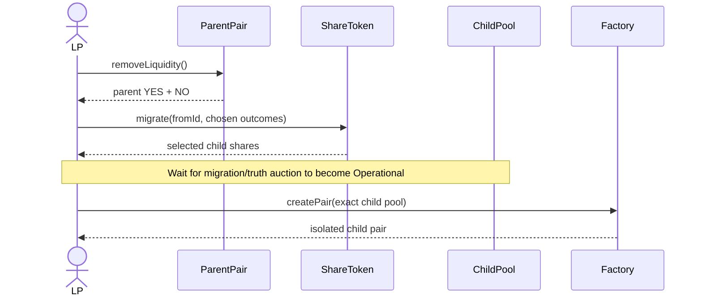
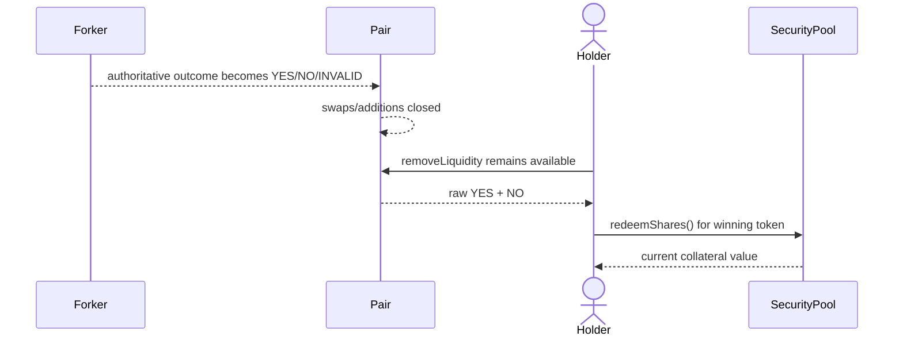

# Forks and resolution

Swaps, initialization, and added liquidity close at question end, when the pool is non-operational or awaiting continuation, when its universe has forked, or when the forker exposes a final outcome. LP removal deliberately has none of those lifecycle guards.

A fork does not select a branch or migrate LP. Parent and child pools may share one ShareToken contract but have different universe-specific IDs and different pair addresses.

On INVALID, matching wallet INVALID is the settlement insurance. Pair YES/NO fee growth does not create INVALID-branch redemption value.
