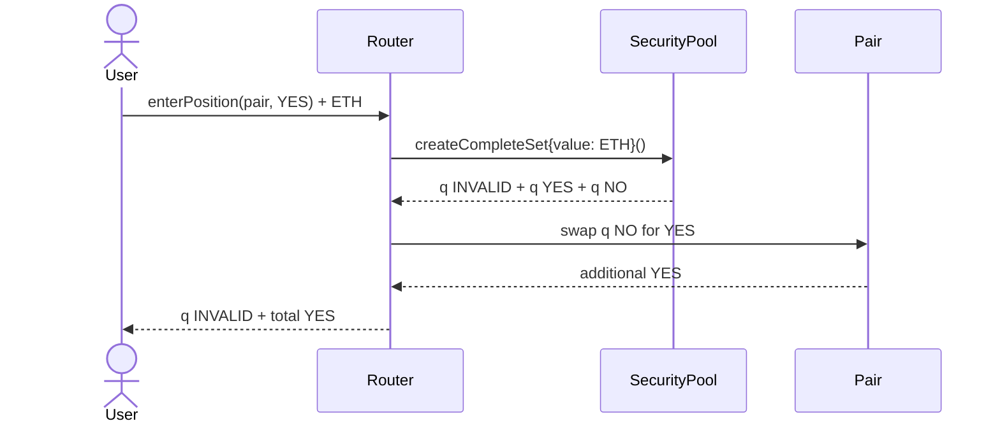

# The two-way market

The [project mental model](../index.md#mental-model) defines the Zoltar contracts and complete-set lifecycle used below.

The pair maintains `k = YES reserve × NO reserve`. A trader entering YES creates a complete set, keeps INVALID, keeps the base YES, and exchanges all NO for additional YES. Entering NO is symmetric.

Example: reserves are 1,000 YES and 1,000 NO, fee is zero, and 100 complete-set shares are created. Swapping 100 NO yields `floor(1,000 × 100 / 1,100) = 90` YES. The wallet receives 190 YES and 100 INVALID; reserves become 910 YES and 1,100 NO (integer rounding raises the product).

A NO purchase simply reverses the reserves. No position record is created: wallet YES, NO, INVALID, and LP balances are the complete accounting state.
